# Assignment 1 学习记录-困惑解决与思考
---

_写在前面：由于教程文件相对较偏向工程实践,其中有一部分相关的原理使我非常感兴趣，以及为了更好理解教程文件的内容含义，知其然而知其所以然，笔者决定对教程文件中一系列自身作为新手容易感到困惑与好奇的部分自我进行梳理，并保留了记录，即此文件。文件主要按照教程文件与作业任务顺序学习的思维路径书写，以保持笔者本人思维的连贯性与编辑的便利性，同时，也在此郑重感谢提供这一系列教程及任务的前辈们，承航顿首。_

---

### 我的基本信息：
    2025级（现大一）人工智能专业 李承航 面试组别：算法组
---

**提示：以下将按照思维顺序书写**

---

### 1.关于起手式的库的一些思考：
1. `import cv2`
导入OpenCV库，用于图像处理和计算机视觉相关操作，由于是整体基础，在此不做过多阐释，唯独补充一点是OpenCV的.imread()的读取图像函数有第二个参数，表示以何种方式读取图像，种类有以下三种，默认第一种
cv2.IMREAD_COLOR：以彩色图像方式读取，忽略alpha通道(代表颜色的透明度和不透明度），默认方式
cv2.IMREAD_GRAYSCALE：以灰度图像方式读取
cv2.IMREAD_UNCHANGED：包含alpha通道，以包含alpha通道方式读取

2. `import numpy as np`
导入NumPy库，并简写为np。NumPy是Python中用于科学计算的基础库，OpenCV的图像数据就是以NumPy数组的形式存储的。

3. `import matplotlib.pyplot as plt`
导入matplotlib的pyplot模块，并简写为plt。常用于绘图和显示图片。

##### 关于这几个库的个中原因梳理：

据我所查到的资料，原因有以下几点
1. cv2作为传统视觉库，自然是要引入的，但是OpenCV的图像数据以Numpy数组的形式进行存储，因而对其进行的一系列操作或使得引入numpy成为必需。
2. matplotlib.pyplot提供与MATLAB相类似的绘图API，作为平常多用于绘制柱状图等统计图形所常用的方式（笔者高中时虽选考生物，但为帮助浙江选考技术的同学更好学习，因而学习过一些相关的统计图绘制），笔者在此斗胆认为后续教程中所显示的图片周边的坐标轴来源于此。并做如下尝试：在每一个.imshow()的后面加上一个plt.axis('off')。

_**带坐标轴的原图：**_

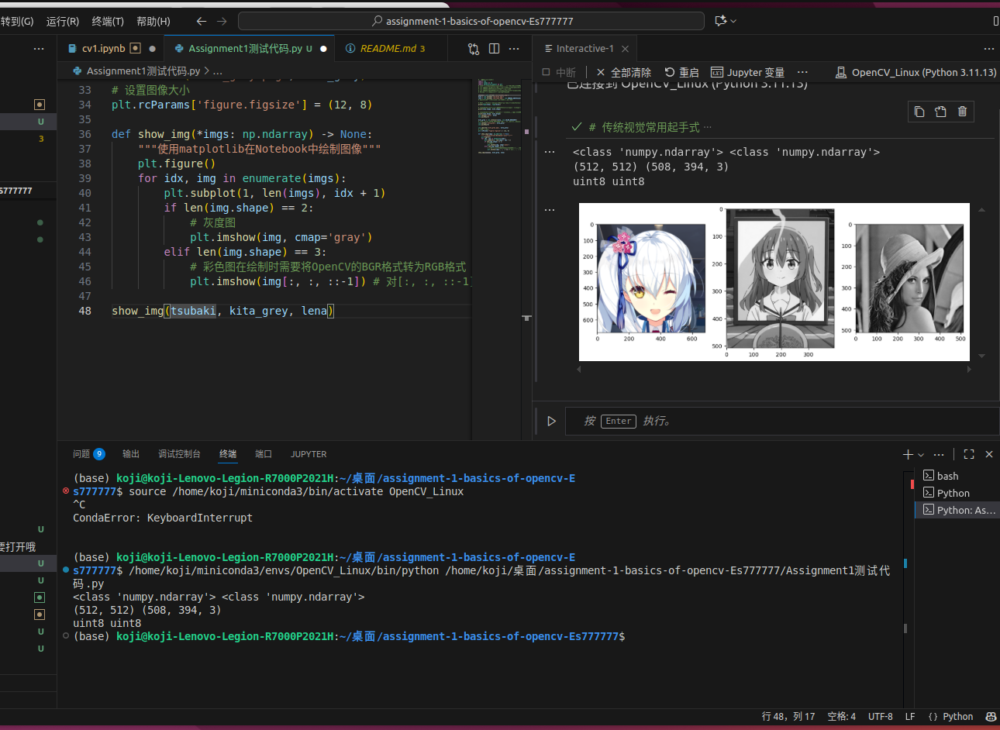

_**加入.axis('off')后的图片输出：**_

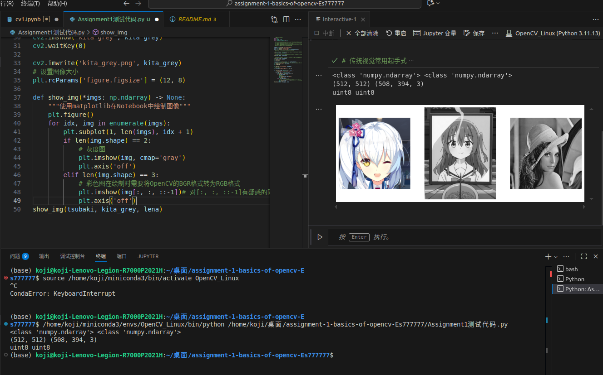

可以看到，这样输出的图片将不再带有坐标轴，证明我们的猜想有一定的道理。

3. 对于文档中ndarray，张量（Tensor）两个部分的笔者通过AI引入一些解释（其实是自己也完全没有听过相关的概念），以方便对于储存图像的数据结构的理解：

**NumPy的核心数据结构ndarray：**： 它的全称是 **N-dimensional array**，即N维数组。它的核心属性正是它的维度（`ndim`）和形状（`shape`）。
**张量（Tensor）**： 在数学和物理学中，张量是一个**多维数组**，它是一个可以表示在多个维度上的数据的数学对象。张量的“阶”（或“秩”）定义了它有多少个维度（轴）。
	**0阶张量**： 标量（Scalar），一个单一的数字。例如： `5`
	**1阶张量**： 向量（Vector），一维数组。例如： `[1, 2, 3]`
	**2阶张量**： 矩阵（Matrix），二维数组。例如： `[[1, 2, 3], [4, 5, 6]]`
	**3阶张量**： 三维数组。例如： 一张RGB图片（高度，宽度，颜色通道）
	**N阶张量**： N维数组。
    _**一个典型的数据处理流程是**_：
_1.使用NumPy从文件（如图片、CSV）中加载数据，得到 **ndarray**。
例如此处读出一个3x3像素的彩色图像在内存中的结构：_

**[
  [[B, G, R], [B, G, R], [B, G, R]],  # 第一行
  [[B, G, R], [B, G, R], [B, G, R]],  # 第二行  
  [[B, G, R], [B, G, R], [B, G, R]]   # 第三行
]**

_2.将这些 **ndarray** 转换为深度学习框架的 **张量**。
3.在GPU上进行高效的张量运算（模型训练、推理）。
4.将结果张量转换回 **ndarray**，以便用NumPy/Matplotlib等进行后续分析或可视化。_

经过对一些教程的查询，笔者大致判断cv2.imread('xxx.png')应当具有.dtype(数据类型)，.shape
(高度, 宽度, 通道数（灰度图像则没有通道数，注意彩图是以BGR顺序排列）)，.max/.min(像素值范围)，.size(总像素数量)以及.nbyte(总大小)

4. `from IPython.display import clear_output` 是Python中导入语句，用于从IPython的display模块中导入`clear_output`函数，主要作用是**清除当前输出单元格中显示的内容**。

---

### 2.关于OpenCV学习过程中的一些疑惑：

##### 1.关于原文中提到的Pycharm运行效果不同：（由于我并没有配置相关的Pycharm软件又对此感到好奇，尝试让AI做出了回答，从而得以管中窥豹）

_在 Jupyter Notebook 或命令行中运行 `cv2.imshow()` 时，OpenCV 会弹出一个独立的窗口显示图片，并且 `cv2.waitKey(0)` 会等待你按下任意键后关闭窗口。_

_而在 PyCharm 这类 IDE 里，`cv2.imshow()` 的窗口有时可能无法正常弹出，或者窗口一闪而过，原因主要有：_

_1. PyCharm 的运行环境和终端不同，窗口管理机制可能和系统原生有冲突，导致窗口无法正常显示或响应。
2. PyCharm 可能会自动回收进程或关闭窗口，特别是在“运行”窗口下，导致 `cv2.imshow()` 的窗口很快消失。
3. 有些 PyCharm 配置下，GUI 相关的操作（如 imshow）需要在主线程运行，而 PyCharm 的运行方式可能不是主线程，导致窗口异常。
4. 在远程开发、WSL 或没有桌面环境的环境下，PyCharm 也无法弹出本地窗口。_

_解决方法：_
_1. 尽量在本地命令行或 Jupyter Notebook 里运行带有 `cv2.imshow()` 的代码。
2. 如果必须在 PyCharm 里运行，可以尝试用 matplotlib 的 `plt.imshow()` 代替，直接在 IDE 的输出窗口显示图片。_

_总结：PyCharm 的运行机制和窗口管理与命令行/Jupyter 不同，导致 `cv2.imshow()` 效果可能不一致。_
##### 2.关于教程中没有解释的一段注释掉的代码：

	while True:
		cv2.imshow('lena', lena)
		if cv2.waitKey(1) & 0xFF == ord('q'):
			break
            
含义：每1ms显示一遍图片窗口，按‘q’退出，也许是为了不断更新图片文件状态？

##### 3.关于二值化：

1. 二值化是图像处理中非常重要的方法，常用于图像分割。
2. 二值化的本质：把一张单通道（灰度）图像的像素值，按照某个阈值，分成两类（通常是0和255），即“黑”和“白”。
3. 阈值的选择会直接影响分割效果。阈值选得好，目标和背景分得清楚；选不好，可能目标丢失或背景被误分。
4. 二值化常用于后续的目标检测、轮廓提取等任务，是很多视觉算法的基础步骤。

核心思想：为什么要转换色彩空间？
我们最常见的图像是 **RGB（红、绿、蓝）** 色彩空间。虽然直观，但RGB的三个通道相关性很高，并且对光照变化非常敏感。例如，一个红色的物体在亮光和暗光下，其R、G、B三个通道的值都会发生很大变化，这给稳定地分割目标带来了困难。
因此，我们常常将图像从RGB转换到其他色彩空间，在这些空间里，**亮度信息（明度）和颜色信息（色调、饱和度）是分离开的**。这样，我们就可以在一个更“纯净”的通道上进行二值化等操作。

下面列举常用的二值化用的色彩空间：
    1.灰度图 - 最常用的“单一”空间
灰度图虽然不是严格意义上的色彩空间，但它是最简单的单一维度。它只包含图像的亮度信息。忽略颜色信息，只关注图像的明暗对比。适用于前景和背景亮度差异明显的场景（如黑白文档）。
    2.HSV / HSL 色彩空间
HSV（色相、饱和度、明度）和HSL（色相、饱和度、亮度）将颜色信息分离得非常好。基于**颜色**进行分割。例如，分割图像中所有“红色”的物体，无论其明暗。
**通道含义**：
**H（色相）**：表示颜色类型（0°-180° 在OpenCV中）。这是进行颜色分割最关键的通道。
**S（饱和度）**：表示颜色的纯度。饱和度越高，颜色越纯。
**V（明度）/ L（亮度）**：表示颜色的明亮程度。
	3. Lab 色彩空间
Lab色彩空间的设计目标是为了感知均匀性，即色彩上的差异程度与人类视觉感知的差异程度成正比。**转换目的**：特别适用于需要精确颜色感知和对比度增强的场景。**L通道**代表亮度，**a通道**代表从绿色到红色的范围，**b通道**代表从蓝色到黄色的范围。

### 3.完成Exercise：
最开始遇到一个奇怪的读取问题，不知道为什么怎么读不出来图片导致报错：

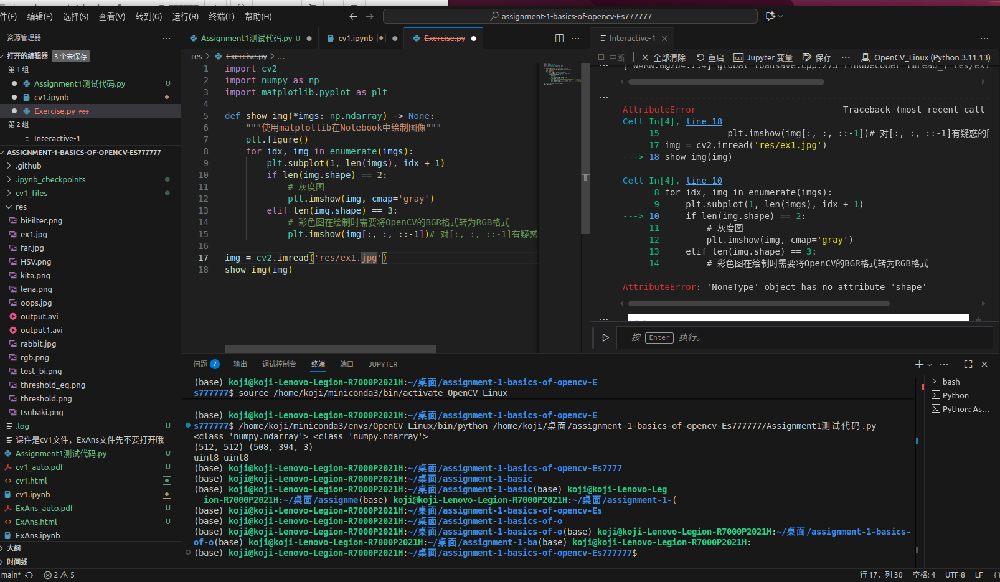

然后尝试微调到同级看看行不行：

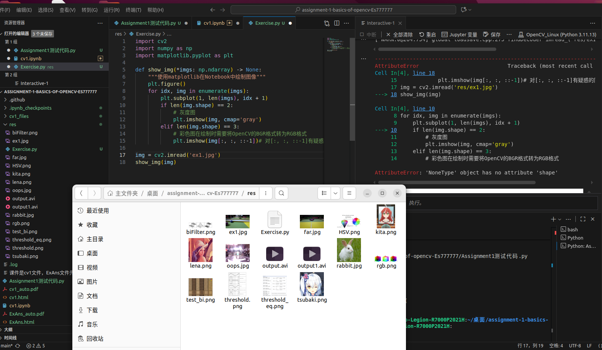

还真的可以，可能我记错了路径的使用方式吧：

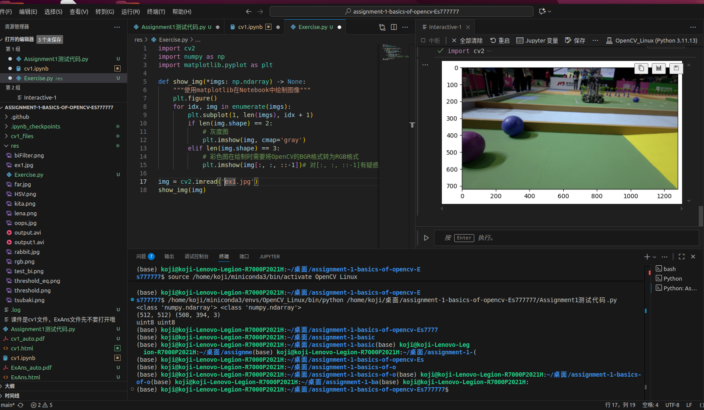

接下来是几版程序的编写与测试：

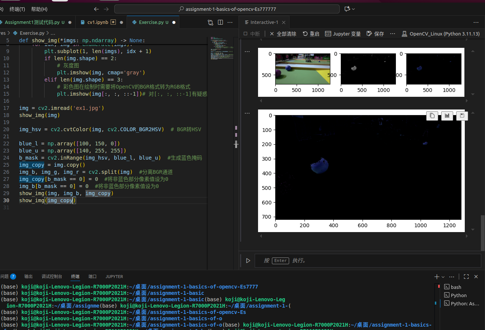

尝试调整掩膜参数：

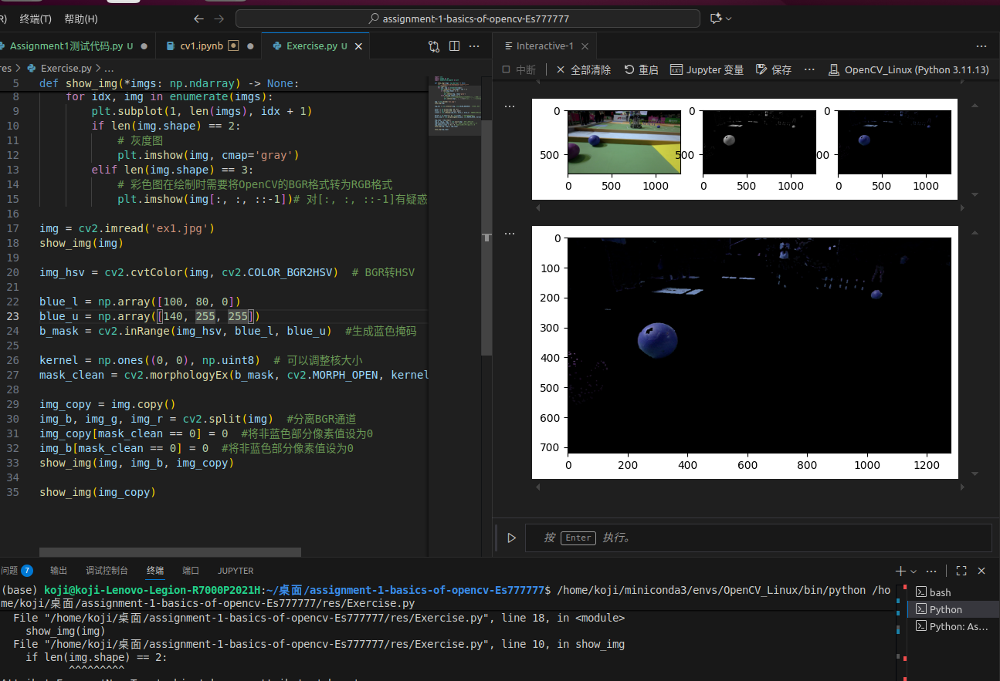

尝试用核去除干扰：

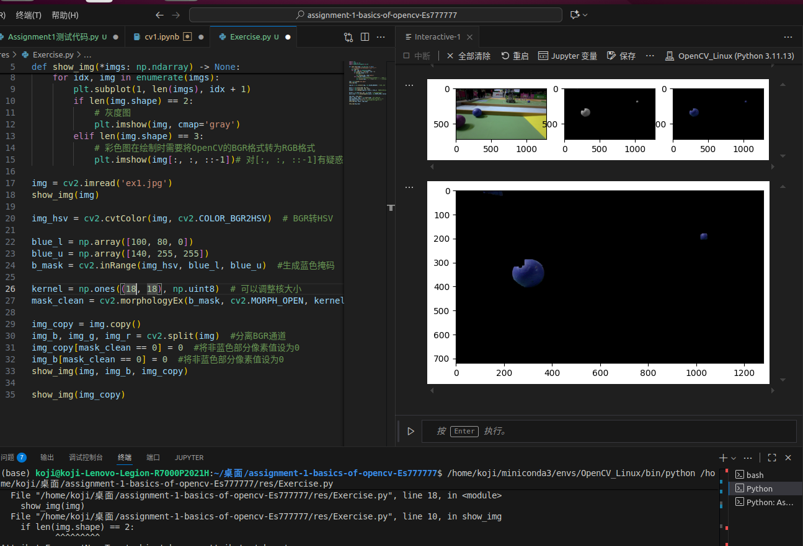

最终版源代码（在上传库里也有一份，放置在res文件夹中，其中核参数与二值化参数均为查阅资料后在附近范围调整所得）

	import cv2
	import numpy as np
	import matplotlib.pyplot as plt
	def show_img(*imgs: np.ndarray) -> None:
	"""使用matplotlib在Notebook中绘制图像"""
		plt.figure()
		for idx, img in enumerate(imgs):
			plt.subplot(1, len(imgs), idx + 1)
			if len(img.shape) == 2:
    			# 灰度图
				plt.imshow(img, cmap='gray')
			elif len(img.shape) == 3:
				# 彩色图在绘制时需要将OpenCV的BGR格式转为RGB格式
				plt.imshow(img[:, :, ::-1])# 对[:, :, ::-1]有疑惑的同学可以研究一下Python的切片

	img = cv2.imread('ex1.jpg')
	show_img(img)

	img_hsv = cv2.cvtColor(img, cv2.COLOR_BGR2HSV) # BGR转HSV

	blue_l = np.array([100, 80, 0])
	blue_u = np.array([140, 255, 255])
	b_mask = cv2.inRange(img_hsv, blue_l, blue_u) #生成蓝色掩码

	kernel = np.ones((18, 18), np.uint8) # 可以调整核大小
	mask_clean = cv2.morphologyEx(b_mask, cv2.MORPH_OPEN, kernel)

	img_copy = img.copy()
	img_b, img_g, img_r = cv2.split(img) #分离BGR通道
	img_copy[mask_clean == 0] = 0 #将非蓝色部分像素值设为0
	img_b[mask_clean == 0] = 0 #将非蓝色部分像素值设为0
	show_img(img, img_b, img_copy)
	
	show_img(img_copy)

### 4.关于滤波与ROI的部分（其他种类的滤波将在后续再去学习，这里仅对文章中提到的高斯滤波与双边滤波做一点分析）：

##### 关于高斯滤波：

通过高斯曲线（正态分布？）使离中间近的像素权重大些，离中间远的权重小些，且在去除椒盐噪声时保护图像细节，可以用.getGaussianKernel方法获取单轴的高斯核（Gaussian kernel），高斯核常用于图像平滑、模糊等操作。这里所谓单轴的含义只在一个方向（一维）上的高斯分布权重数组，比如 shape 是 (5,1) 或 (1,5)，只在水平方向或竖直方向有权重分布。用 `cv2.getGaussianKernel(ksize, sigma)` 得到的就是一维（单轴）高斯核，是一个列向量。在高斯核（Gaussian kernel）中，sigma（σ）是“标准差”参数，决定了高斯分布的“宽度”或“模糊程度”。sigma 越大，高斯核越“宽”，模糊效果越强，图像会变得更平滑、细节丢失更多。sigma 越小，高斯核越“窄”，模糊效果越弱，图像细节保留更多。

_二维高斯核可以通过单轴高斯核的外积（dot）得到，即 `kernel_2d = kernel_1d.dot(kernel_1d.T)`。用两个一维高斯核分别在x、y方向卷积，等价于用一个二维高斯核卷积，计算更高效。单轴高斯核就是一维的高斯滤波器，只对一行或一列做模糊。二维高斯核则是对整个区域做模糊。（仅作补充说明）_

##### 关于双边滤波：
双边滤波（Bilateral Filter）是一种同时考虑空间距离和像素值相似性的非线性滤波方法，常用于图像去噪、平滑的同时保留边缘信息。主要考虑：
空间域权重：距离中心像素越近，权重越大（类似高斯模糊）。
像素值域权重：像素值与中心像素越接近，权重越大（防止跨边缘模糊）。
能有效去除噪声，同时保持图像边缘清晰，不会像普通高斯模糊那样把边缘也模糊掉。
函数： cv2.bilateralFilter(src, d, sigmaColor, sigmaSpace)
* src：输入图像
* d：领域直径（像素邻域的直径）
* sigmaColor：颜色空间的标准差（像素值相近的影响范围）
* sigmaSpace：坐标空间的标准差（空间距离的影响范围）

##### 关于均值滤波：
**均值滤波**是一种常用的线性滤波方法，主要用于图像或信号处理中的**噪声平滑**。它通过计算邻域内像素的平均值来替代中心像素的值。核心思想是用邻域内像素的平均值代替原像素值，从而减少图像中的随机噪声。

##### 关于ROI：
关键在于记住图片的原点左上角，（行，列，通道（默认切：全都要））

# 关于Homework：
虽然已经有轮子，但是这个项目仍然对于初学者是有一定的难度的，笔者将这个任务完成的部分
首先，我们注意到这个调参小工具他的图像显示是倒着的，这在一定程度上使得直接通过这个工具自带的坐标轴直接确定我们想要ROI的区块变得困难，因而笔者在思考，我们能否将其转过来呢：

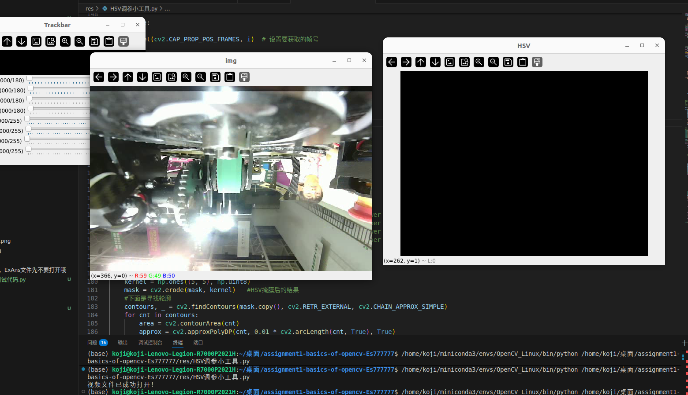

这时，注意到我们HW下面的示例代码中有:

	_,frame = cam.read() 
	frame=cv2.rotate(frame, cv2.ROTATE_180)

而这里的cam恰恰对应了调参小工具当中的cap（逐帧读取视频图像cv2.VideoCapture(r"res/output.avi")
的结果），因而笔者推测，这个读取的数据的结构应当是输出两个量，前一个输出一个布尔值用于确定是否有图像存在，而后一个输出量frame则为这个图像的一个3d-array，输出为（行，列，通道数），这也呼应了ROI部分切片的[:,:,:]格式，进一步印证了笔者的猜想。

将其运用到我们的调参工具文件中，如图所示：

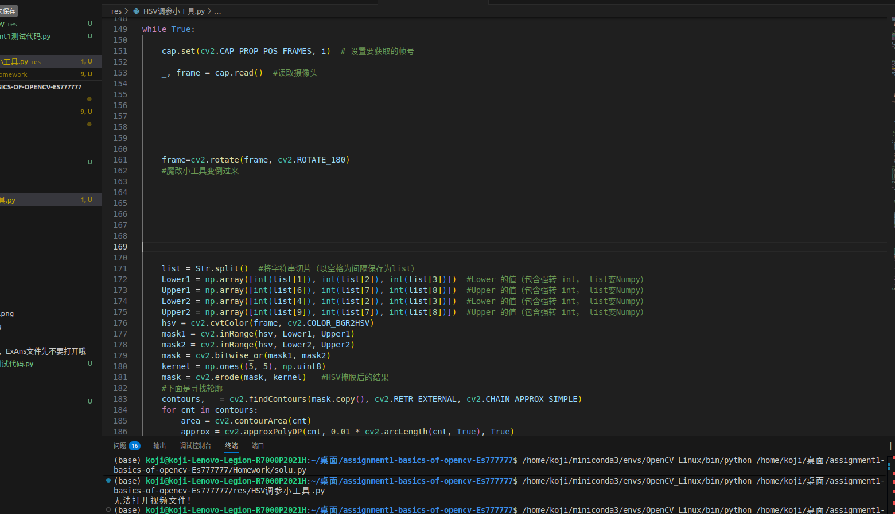

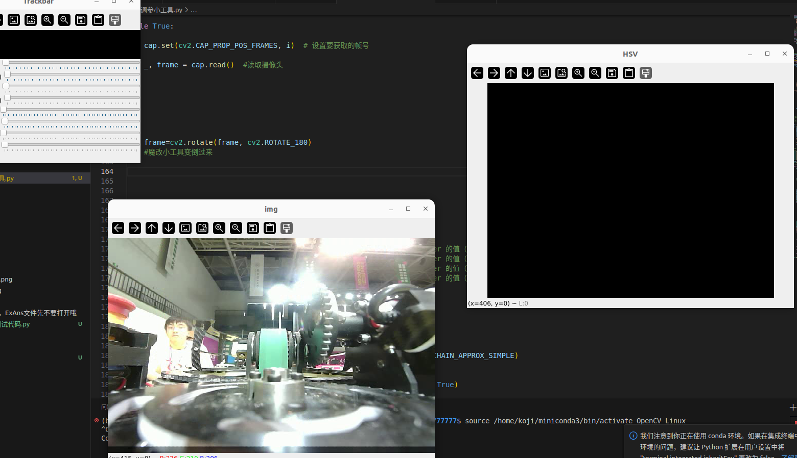

其实这一步直接通过AI搜索或者使用手册等工具是极易发现的，但是在源码的不同使用中判断数据的输入与输出在笔者眼中是一件很有意思的事，经过这样的尝试我们可以对于OpenCV的一些函数拥有更深的理解。
然后笔者发现，这个小工具他不能直接显示hsv值，这无疑使得我们只能从六个值里面蒙范围，这极大阻碍了我寻找二值化阈值的脚步，于是笔者利用AI改写了这个工具，使其可以在终端中实时显示鼠标位置的hsv三值，由于源代码过于冗长，这里仅将源码（HSV调参1）同该文档在同一文件夹内存储，并在下图的终端栏可以看到hsv值的实时显示。
以下是调参过程的截图，先ROI：
左ROI
	
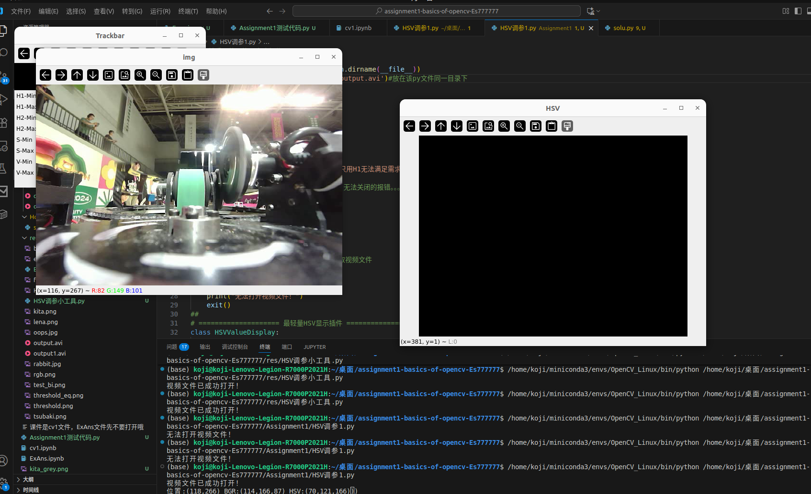

上ROI：

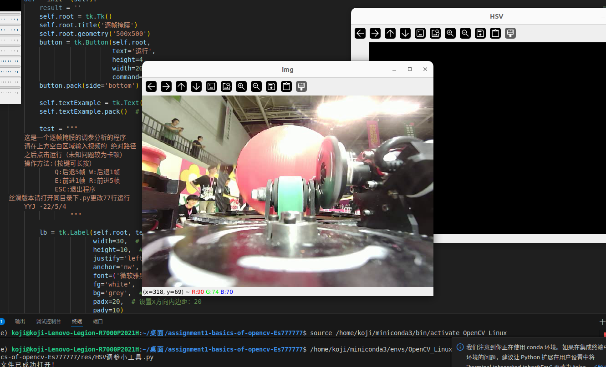

下ROI：

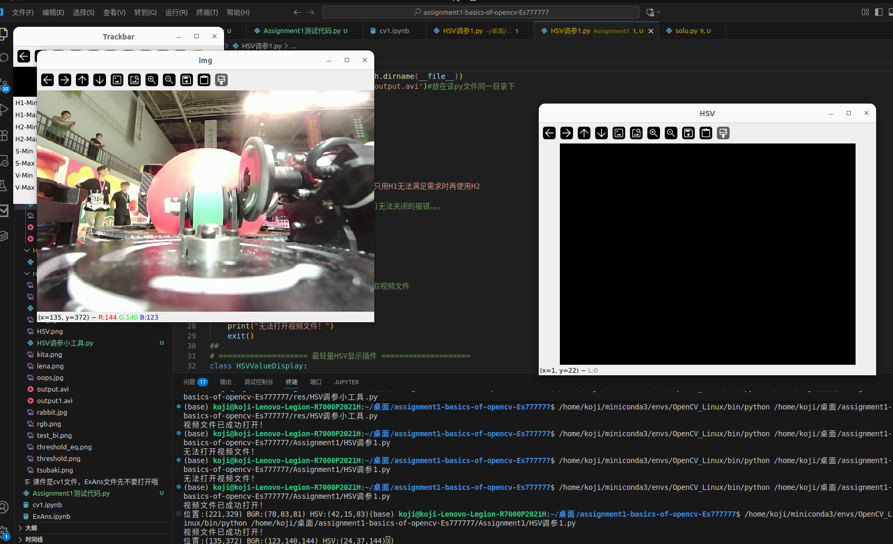

接下来是球体hsv的测量：
红球：

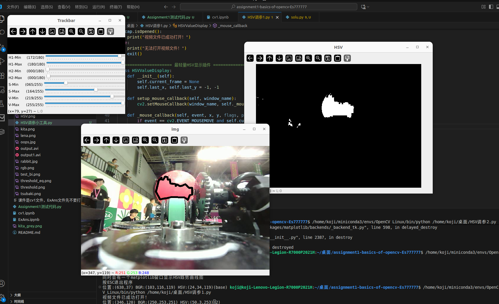

蓝球：

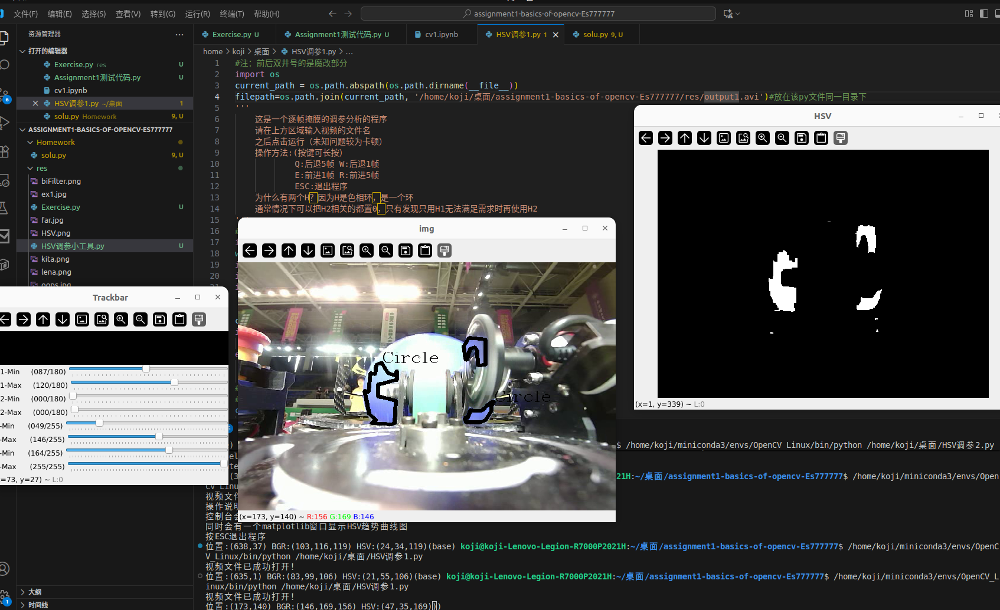

紫球：

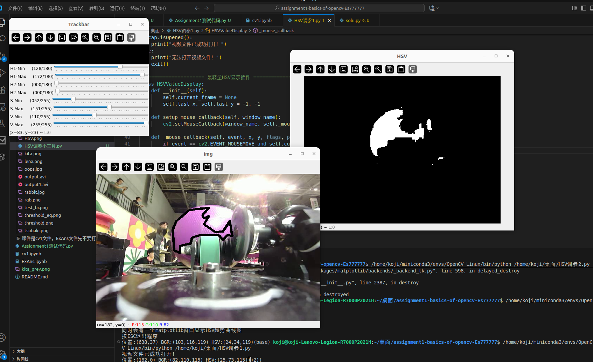

完成基本的数据测量，接下来我们要开始源代码的编写，根据要求，其相关文件均存放于要求的Homework文件夹下，而其阐释与思考均在代码行中与注释中得到体现，在此处不多赘述，仅做一点强调，由于笔者在实践过程中使用多个颜色组合掩膜总是会出现误判情况（也许是我的参数调整问题），总之由于多次尝试均不尽如人意，笔者最终选择删去了这部分的逻辑，而专注于单一掩膜的精确判断，完整的代码实现思路在下方。

_后记：本文的写作以及其中相关测试，代码调整约耗费笔者近25小时的时光，然而在其中所体会到的代码思想及算法思路其益远胜于这段时间的耗费，再次感谢对应教程材料的编写者前辈们，最后也感谢感谢对此下了苦功夫的自己吧，为了这份文件的编写与自己的一些求知欲做了很多有趣的岔路，尽管很多尝试并不一定是必要的，但的确于此收获颇丰。_
																											_——李承航  写于2025.9.27夜_
                                                                                                            
                                                                                                            
# Assignment 1 作业完成思路（代码实现）

## 1.分析工作：
要完成的部分有：
1. Config读取
2. BallDetector主类
3. ColorRange类
4. 视频读取与展示识别结果
5. 最后用AI帮我整理一下结构使代码块排版整齐结构通顺
## 实现思路分析：
1. 读取配置文件我从网络找了相关的读取模版，这里在搞读取文件时我尝试使用相对路径一直失败，最后找了一个相对路径转绝对路径生成的方式如图：

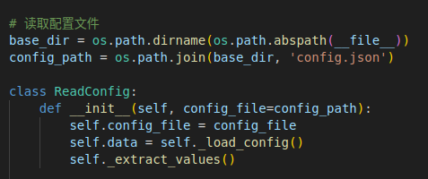

后面根据config存储的我手测的参数编写了具体的范围读取

2. 这是读取出来的颜色要求范围，先转作范围待用：

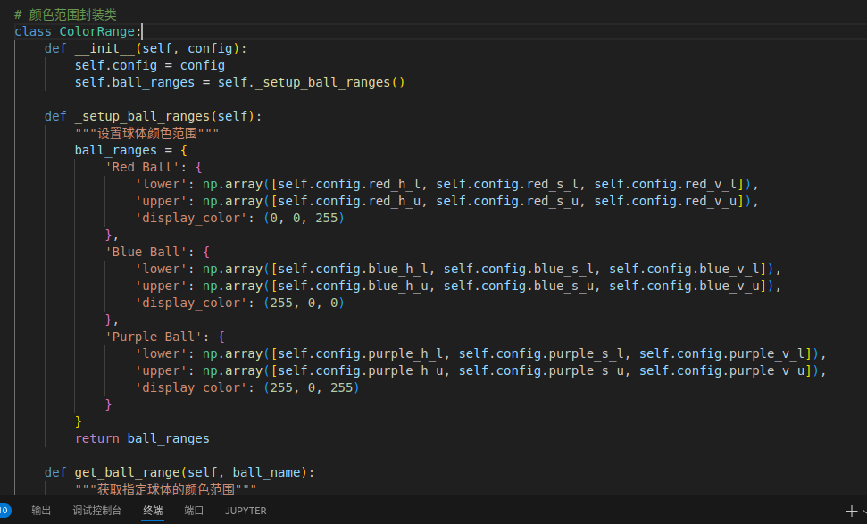

借鉴了教程中的掩膜思路如图：

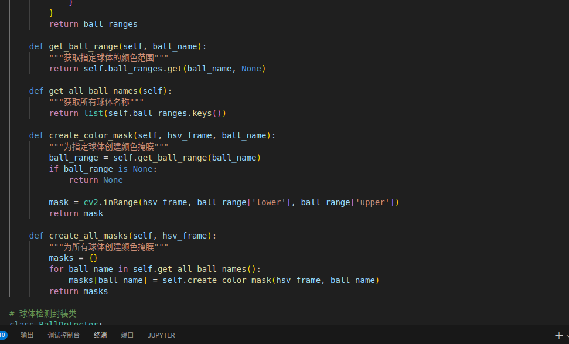

3. 接下来是球体检测类（这个阈值我也试了好多次）：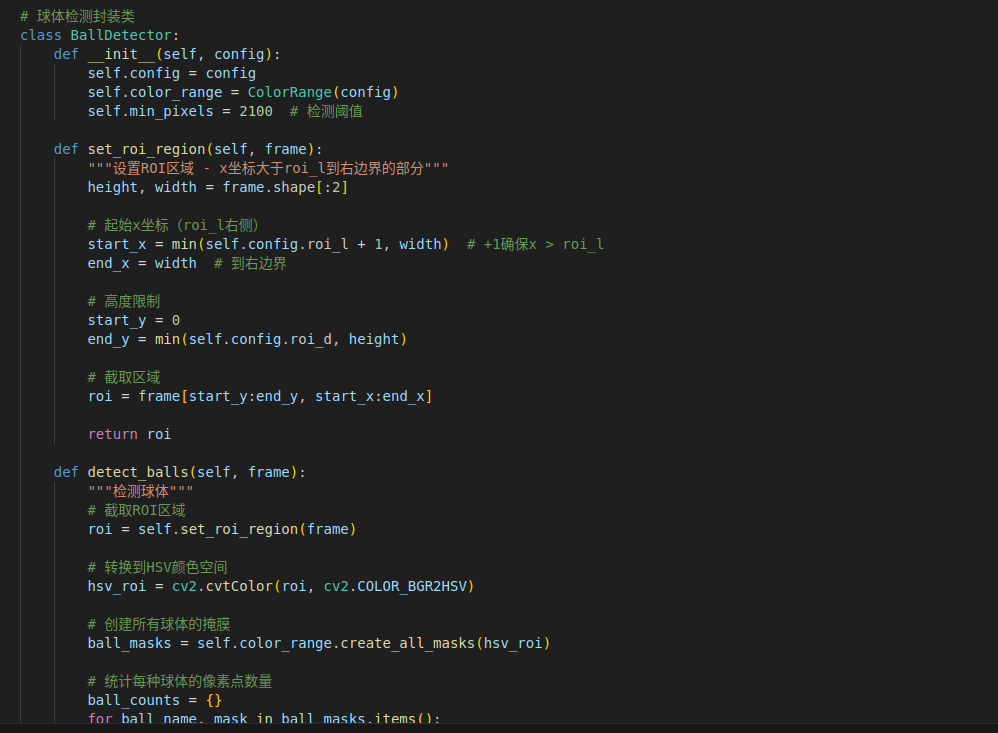

   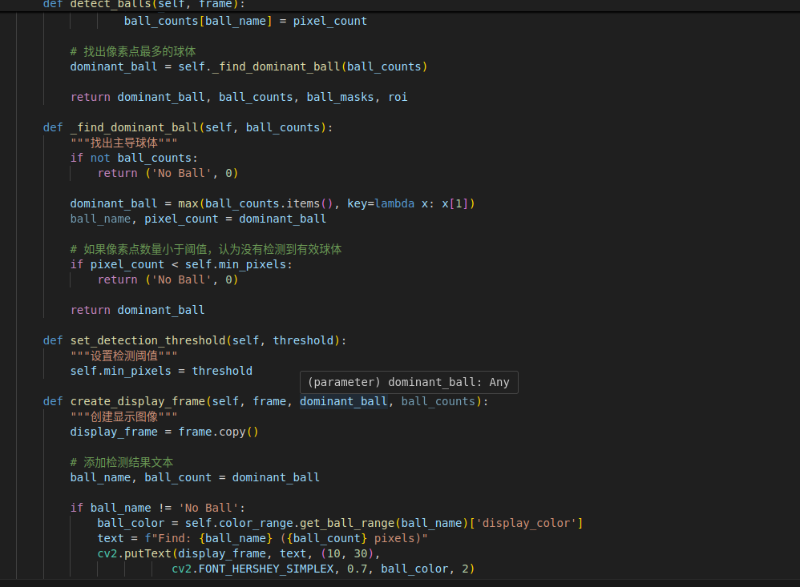
   实现思路是依靠检测特定颜色像素点的个数

   4. 最后是视频显示部分，我选择直接借鉴了调参工具的书写方式然后在其中的while循环写了个自动加一使之可以主动播放也可以调帧：
  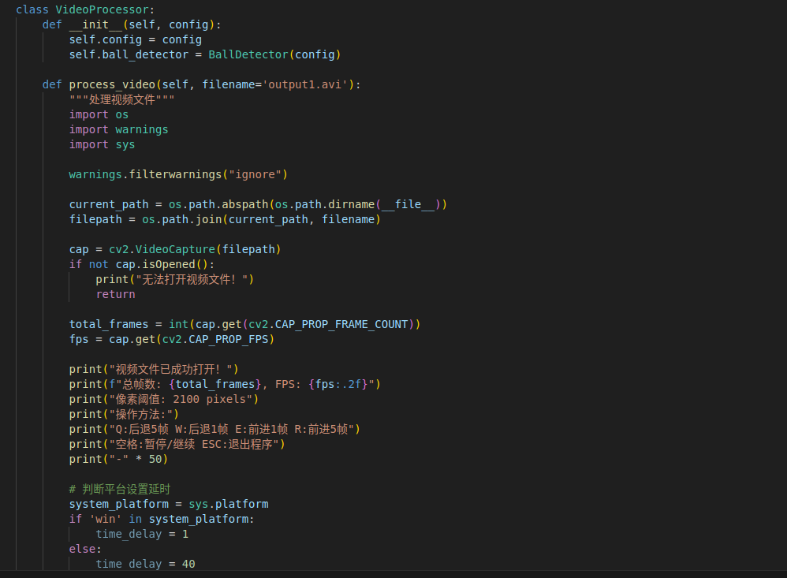

i+=1实现自动播放，懒人写法：

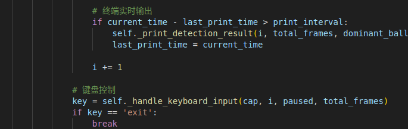

